# Task 2 - Spring Rest API with H2 DB

This is a REST API that can create, read, update and delete products, with Spring Boot and an H2 database.

## Endpoints

### Adding a new Product

``POST - http://localhost:8080/api/v1/products
``

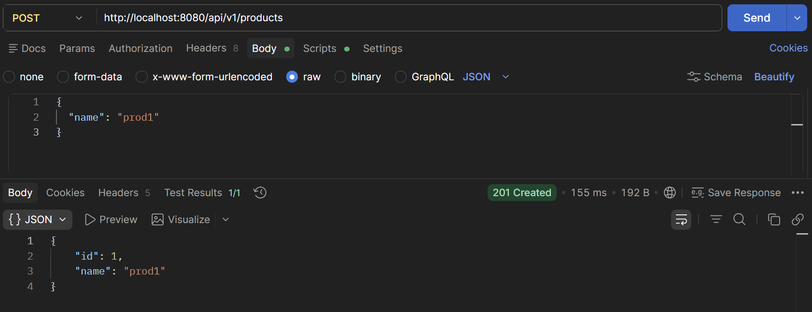
- The Client can enter the name for the product in JSON and POST it
- The system then Generates a Unique id based on the count of products added 
- Returns the Name and the Generated ID back to the user 
- With 201 Created status

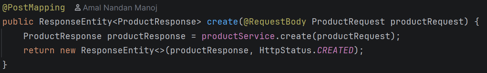
- `@PostMapping` Telling this `create` method listen to Post request
- `@RequestBody` Reads the JSON from Postman here 
- The request is then passed to the `create` in service
- Returns the response with created status 

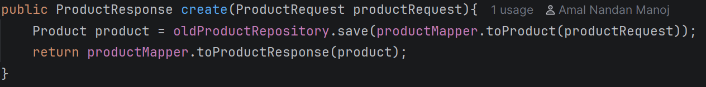
- Inside the create the product request is transformed into a product using `toProduct` from Mapper
- And saved in the repository
- The product is then transformed back into a response and returned
```
protected final Map<Long, Product> map =  new HashMap<>();

protected long counter = 1;

public Product save(Product entity) {
setId(entity);
return entity;
}
private Product setId(Product entity) {
if(entity.getId() != null){
map.put(entity.getId(), entity);
}else{
entity.setId(counter);
map.put(counter, entity);
counter++;
}
return entity;
}
```

- The Products are stored in `HashMap<>`
- The Product is saved in the DB after checking if it already have an ID
- If it doesnt have an id then a new id is generated and assigned

---
### Getting a Product by its ID

``GET - http://localhost:8080/api/v1/products/1
``

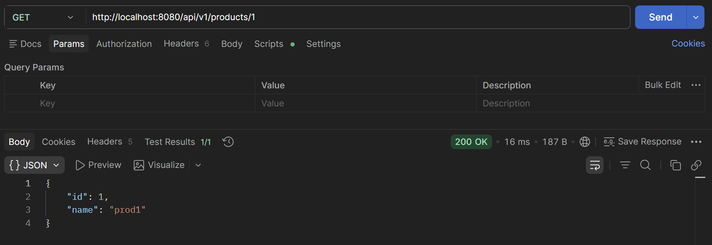
- Client can request to get the data of a product just from the id here
- The system returns the product with its id and name back with 200 Ok Status

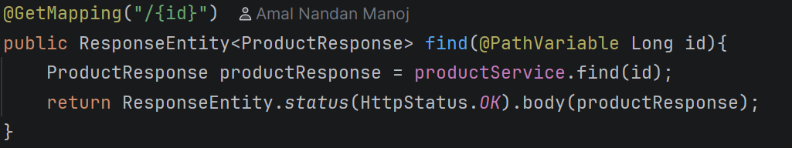
- `@GetMapping` listens to GET request from /{id} URl
- `@PathVariable` grabs the number at the url to `long id`
- id is then send to the `find` method in service and the return response is stored 
- Returns the response with Http status 200 and puts the response in the body

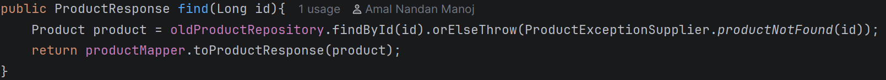
- The id is then send to the `findById` method in the repository 
- And the product is then transformed into a response and returned
- if the is not valid not found a new `productNotFound` exception is raised

```
public Optional<Product> findById(Long id){
    return Optional.ofNullable(map.get(id));
}
```
- Takes an id number and Returns an Optional that may or may not contain a Product

---
### Get all items from the Database
``GET - http://localhost:8080/api/v1/products
``

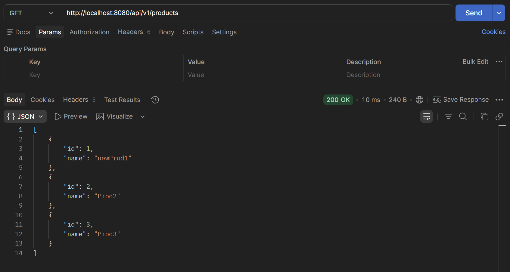

- Returns al the Products in the database with their name and id
- with 200 ok Status

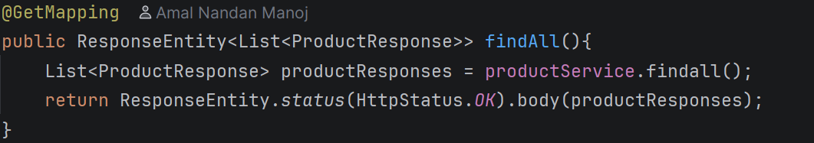
- `@GetMapping` Mapped to the base of the URL
- `findAll` method is initated the Response list is saved
- Returned the response list in the Response body and status Ok

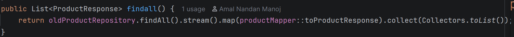
- Once `findAll` is initiated it steams through the Db and returns the product
- Every product is then transformed into a response using `map`
- And then `collect` Collects all of them into a list 
- The list is then Returned

---
### Update an item using its ID
``PUT - http://localhost:8080/api/v1/products/1
``

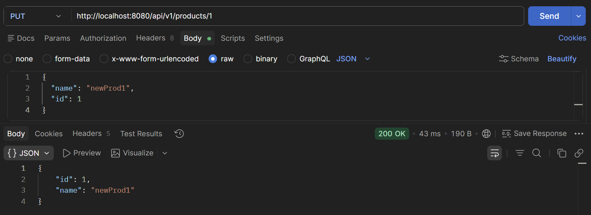
- The Client can change the id and name of a product in the database
- Returns the updated product with 200 ok status

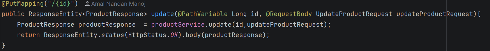
- `@PutMapping` listens to PUT request from /{id} URL
- `@Pathvariable` id is taken from the url
- Name and id as UpdateProductRequest is then taken from the Body
- The request is then send into the update method in service
- The updated product is returned as a response and stored
- The response  is then returned

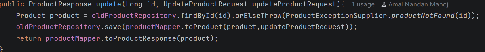
- The Product is taken in from the repository 
- If found then the `save` method from the repository is initiated to save it again with the update values
- The updated product is then transformed into a reponse and returned

---
### Delete an item 
``DELETE http://localhost:8080/api/v1/products/1
``

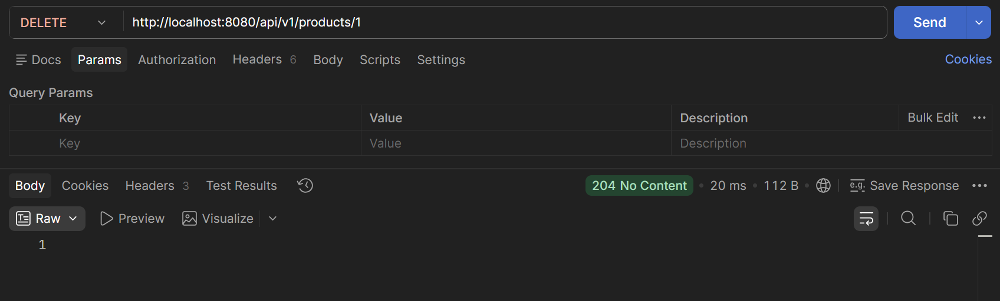
- The Client can Delete an item from the Database with its ID
- Returns 204 No content

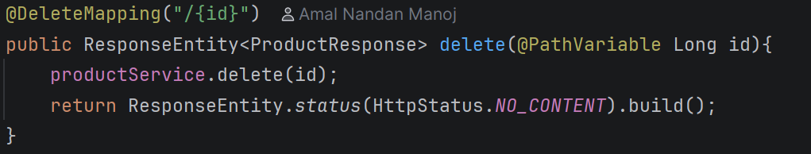
- `@DeleteMapping` listens to DELETE request from /{id} URL
- `@Pathvariable` id is taken from the url
- `delete` method in service is initiated
- Only returns the status and an empty build

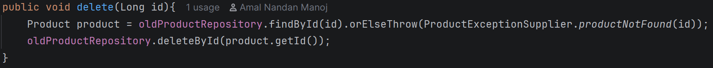
```
public void deleteById(Long id){
    map.remove(id);
}
```
- The Product is taken from the DB using `findByID`
- Then `deleteById` deletes the product using `map.remove()`

---
## Exception Handling

When the client requests for a product that doesnt exist the application handles that using the help of 3 Classes

- `ProductNotFoundException` - custom Exception extends RuntimeException. It takes the product id and returns a error message with it
- `ProductExceptionSupplier` - Creates a new excpetion whenever its needed 
- `ProductExceptionAdvisor`  - Catches the exception and send the response to the client. When no product is found Status 404 Not Found with a Json message saying the "Product with id 99 not found" is send

---

##Swagger UI
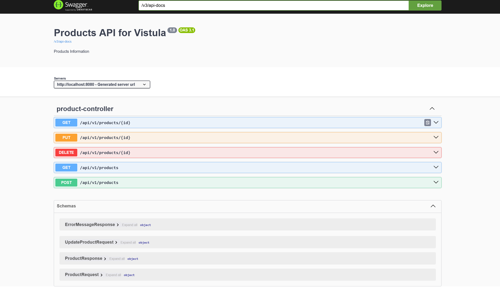

---
>How the Database work without having anything in the Repository class?

The Repository class extend JpaRepository Which already have these methods in it for the database